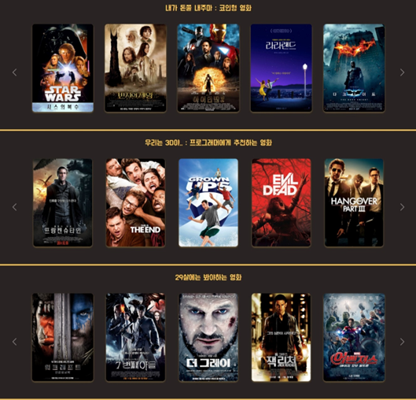
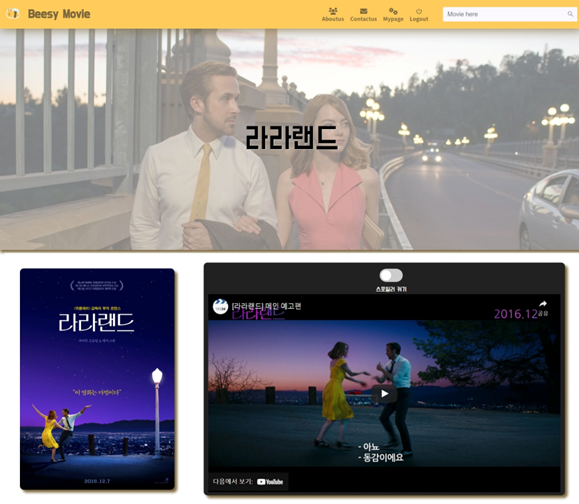

# Beesy Movie:bee:

> "배달만 시켜놔, 영화는 골라줄게" : 현대인들을 위한 영화 추천 서비스

---

### 개발 배경:city_sunset:

- 하루하루 벌어사는 현대인들에게 영화 선택과 관람은 귀찮은 일
- 가만히 있으면 영화도 추천해주고, 가볍게 시청했으면 하는 욕구 

---

### Service:gift:

- 바쁘디 바쁜 현대사회에 지쳐 자신의 취향을 찾기도 힘든, 영화를 볼 시간도 없는 현대인들을 위한 초정확, 초신속 추천 영화 리뷰 제공 서비스 

  -  [Movie Lens](https://grouplens.org/datasets/movielens/)의 100만 데이터와 TMDB API를 활용해, 유저에게 최적의 영화를 추천하는 플랫폼

  - [YouTube API](https://console.cloud.google.com/home/dashboard?project=clean-pilot-349402&_ga=2.224289883.1362455139.1653572302-1845726553.1651802492&_gac=1.127077119.1653572302.CjwKCAjwyryUBhBSEiwAGN5OCBaFn7uZmjxCei1Jz96JDg4YvRNrX4ZCeBG4TusIQhTR5LtCxt37hBoCyvkQAvD_BwE&pli=1)를 통해 추천받은 영화의 예고편을 보여주고,  유저의 요청에 따라 리뷰 영상 제공

---

### Core Function:gear:

1. Movie Recommendation

   - 사용자 정보 기반한 직업, 연령, 성별 영화를 제안합니다.

   

2. Movie Shorts

   - 영화 상세페이지에서 미리보기와 짧은 정주행 기능을 제공합니다.

   

   

---

### Built With:computer:

1. Frontend

   - Vue.js
   - Vuex
   - Vue-router

   

2. Backend

   - Django
   - Django REST framework
   - SQLite3

   

---

### Developers:hammer_and_wrench:

- 전재권

  - SSAFY 7기

  - Backend

    - TMDB data pre-processing part
    - Django Authorization & Authentication part

  - Frontend

    - Vuex-store structure part
    - Vue-CSS part

    

- 문요성
  - SSAFY 7기
  - Backend
    - Movie Lens data pre-processing part
    - Django model & form & serializer part
    - API management part
  - Frontend
    - UI/UX planning part

